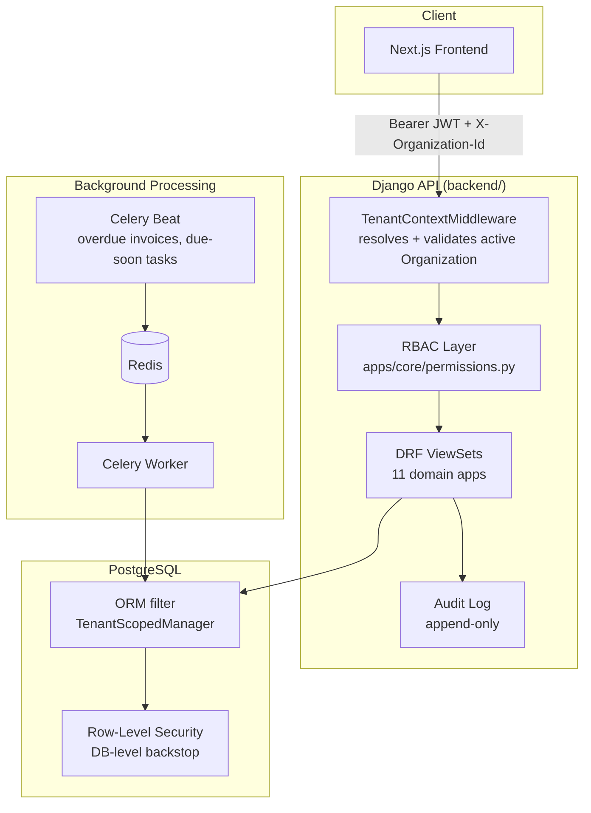

# Baseline


Multi-tenant B2B SaaS platform combining CRM, project management,
invoicing, and internal operations tooling. This repository is a monorepo
containing both the API backend and the web frontend.

> **Status:** Backend is feature-complete for the confirmed MVP scope and
> internally verified (see [Verification & Known Gaps](#verification--known-gaps)
> for exactly what "verified" does and doesn't mean here). Frontend is a
> verified technical scaffold with no product pages yet — see
> [Frontend Scope](#frontend-scope-currently-undecided).

---

## Table of Contents

- [Repository Layout](#repository-layout)
- [Architecture](#architecture)
- [Tech Stack](#tech-stack)
- [Getting Started](#getting-started)
- [Environment Configuration](#environment-configuration)
- [Naming Reference](#naming-reference)
- [Testing](#testing)
- [Verification & Known Gaps](#verification--known-gaps)
- [Frontend Scope (Currently Undecided)](#frontend-scope-currently-undecided)
- [Deployment](#deployment)
- [Security](#security)
- [Contributing](#contributing)
- [Troubleshooting](#troubleshooting)
- [Roadmap](#roadmap)
- [License](#license)

---

## Repository Layout

```
baseline_app/
├── .gitignore              # combined — Python/Django + Next.js/Node
├── README.md               # this file
├── docker-compose.yml       # orchestrates both ends + Postgres + Redis
├── backend/                 # Django + DRF API — see backend/README.md
│   ├── apps/                 # 11 domain-separated Django apps
│   ├── config/                # settings (base/development/production/test), urls, celery
│   ├── requests.http           # full endpoint reference — every route, ready to run
│   ├── Dockerfile
│   ├── requirements.txt / requirements-dev.txt
│   └── .env / .env.example
└── frontend/                 # Next.js app — see frontend/README.md
    ├── src/app/                # App Router pages
    ├── src/lib/                  # API client, utilities
    ├── src/components/ui/         # UI primitives
    ├── Dockerfile.dev
    └── .env / .env.local / .env.example / .env.production
```

---

## Architecture



**Tenant isolation is two-layer, by design, and neither layer is
considered sufficient alone:**

| Layer | Mechanism | Catches |
|---|---|---|
| ORM | `TenantScopedManager` filters every query by `organization_id`, sourced from a request-scoped contextvar — never client input | Normal application code paths |
| Database (backstop) | Postgres Row-Level Security policies on every tenant-scoped table | Raw SQL, admin misuse, a buggy one-off script, anything that bypasses the ORM layer |

This is also why **PostgreSQL is a hard requirement in every environment,
including local dev** — RLS doesn't exist on SQLite. Running dev on SQLite
would mean the backstop layer never actually executes until production,
which is the worst possible place to discover a tenant-isolation defect.

Full technical detail, including the RBAC/audit/billing/notifications
design rationale, lives in [`backend/README.md`](backend/README.md).

---

## Tech Stack

| Layer | Technology |
|---|---|
| Backend framework | Django 5.1, Django REST Framework |
| Database | PostgreSQL 16 (RLS-dependent — see Architecture) |
| Auth | JWT (`djangorestframework-simplejwt`), abstracted auth backend (SSO-ready) |
| Background jobs | Celery + Celery Beat, Redis broker/result backend |
| Frontend framework | Next.js 15 (App Router), React 19 |
| Styling | Tailwind CSS v4 |
| Forms | react-hook-form + zod |
| Language | TypeScript (frontend), Python 3.12 (backend) |
| Containerization | Docker + Docker Compose (local dev) |

---

## Getting Started

### Prerequisites

- Docker + Docker Compose (recommended path), **or**
- Python 3.12+, PostgreSQL 16+, Redis 7+, Node.js 20+ (manual path)

### Quickstart (Docker)

```bash
git clone <repo-url> baseline_app && cd baseline_app

cp backend/.env.example backend/.env
cp frontend/.env.example frontend/.env.local
# edit backend/.env:      DJANGO_SECRET_KEY at minimum
# edit frontend/.env.local: EmailJS values once that account exists

docker compose up --build
docker compose exec web python manage.py migrate
docker compose exec web python manage.py createsuperuser
```

This starts, together: PostgreSQL, Redis, the Django API
(`localhost:8000`), a Celery worker, Celery Beat, and the Next.js dev
server (`localhost:3000`).

> **No public Organization-creation endpoint exists yet.** Bootstrap your
> first tenant via Django admin or shell — see the note at the top of
> [`backend/requests.http`](backend/requests.http).

### Manual setup (without Docker)

See [`backend/README.md`](backend/README.md#setup--without-docker) and
[`frontend/README.md`](frontend/README.md#setup) for per-project steps.

---

## Environment Configuration

Each project has its own `.env.example` as the canonical reference for
required variables — see [`backend/.env.example`](backend/.env.example)
and [`frontend/.env.example`](frontend/.env.example). Summary:

| File | Loaded by | Purpose |
|---|---|---|
| `backend/.env` | Django (via `python-decouple`) | Local dev secrets — gitignored |
| `backend/.env.example` | — (reference only) | Committed template, no real secrets |
| `frontend/.env` | Next.js, all environments | Non-secret, environment-independent values |
| `frontend/.env.local` | Next.js, all environments (highest precedence) | Local dev overrides — gitignored |
| `frontend/.env.production` | Next.js, production builds only | Production values — gitignored, set via hosting provider in practice |
| `frontend/.env.example` | — (reference only) | Committed template |

---

## Naming Reference

This repository is **Baseline**, both ends.

- If you encounter a `.gitignore` or codebase referencing **Verazi**
  (Django + SQLite + Channels) — that is a separate, independent product.
  Nothing in this repository uses SQLite or Channels; do not merge
  patterns, assumptions, or configuration from Verazi into Baseline.
- The frontend was originally scaffolded under the working name
  `casafrique`; `package.json` / `package-lock.json` have been renamed to
  `baseline` to match the backend.

---

## Testing

| Target | Command | Requires |
|---|---|---|
| Backend test suite | `pytest` (from `backend/`) | Live PostgreSQL + Redis |
| Backend endpoint reference | Open `backend/requests.http` in VS Code (REST Client extension) or JetBrains HTTP Client | Running API |
| Backend static checks | `python manage.py check`, `python manage.py makemigrations --check --dry-run` | None (no DB needed) |
| Frontend build/lint | `npm run build`, `npm run lint` (from `frontend/`) | None |

`backend/apps/*/tests/` covers tenant isolation, RBAC grants, audit-log
immutability, NDPA hard-delete, Lead→Customer conversion, entitlement
enforcement, and scheduled-task idempotency.

---

## Verification & Known Gaps

Being precise about what has and hasn't actually been run, rather than
implying more confidence than is warranted:

| Item | Status |
|---|---|
| Django model graph / settings consistency | ✅ Verified — `manage.py check` and `makemigrations --check --dry-run` both pass clean |
| Celery task registration + beat schedule | ✅ Verified — confirmed via direct app introspection |
| Frontend build/lint/lockfile integrity | ✅ Verified — `npm ci`, `npm run build`, `npm run lint` all executed and pass |
| Backend running against a **live** Postgres + Redis instance | ⚠️ **Not yet verified from this side.** Run `docker compose up` + `pytest` before treating the backend as production-verified rather than internally consistent |
| RLS policies under concurrent/adversarial access | ⚠️ Not yet load- or penetration-tested |
| Public Organization-creation endpoint | ❌ Does not exist — bootstrap via admin/shell only |
| Transactional email delivery | ❌ `EMAIL_BACKEND=console` — invitation emails print to console, no provider wired up |
| CI pipeline | ❌ None — no automated lint/test/migration-check on push |

---

## Frontend Scope (Currently Undecided)

The frontend's dependency set — EmailJS, a single Radix primitive,
react-hook-form + zod, no data-fetching/table/chart/session-management
libraries — reads like a marketing or lead-capture site, not a dashboard
for an 11-app multi-tenant CRM. Building real pages before this is
resolved risks discarding work if the assumption is wrong. See
[`frontend/README.md`](frontend/README.md) for the full reasoning.

---

## Deployment

| Component | Expected target | Notes |
|---|---|---|
| Backend | Any container host supporting PostgreSQL + Redis (e.g. Railway, Render, AWS ECS, Fly.io) | `backend/Dockerfile` is production-oriented (multi-stage, non-root user, gunicorn) |
| Frontend | Vercel | `.vercel` is gitignored on that assumption; `frontend/Dockerfile.dev` is **local-dev only**, not a production image |
| Database | Managed PostgreSQL 16+ with RLS support | Any standard managed Postgres offering supports RLS — no special tier required |
| Background jobs | Same host as backend, or a dedicated worker dyno/service | Celery worker + Celery Beat are separate long-running processes, not HTTP-triggered |

No infrastructure-as-code (Terraform, Pulumi, etc.) exists yet — hosting
provider has not been confirmed as of this writing.

---

## Security

- **Tenant isolation:** two-layer (ORM + Postgres RLS) — see [Architecture](#architecture).
- **Authentication:** short-lived JWT access tokens (15 min) with rotating,
  blacklist-on-rotation refresh tokens.
- **Authorization:** centralized RBAC (`apps/core/permissions.py`) — no
  inline role checks anywhere in view/service code.
- **Audit trail:** append-only `AuditLog`, enforced at both the ORM layer
  and a Postgres trigger (DB-level immutability, not just an application
  convention).
- **NDPA compliance:** consent/source tracking on Customer/Lead records;
  real hard-delete path for data-subject erasure requests, distinct from
  ordinary archive/soft-delete.
- **Secrets:** never committed — `.env*` files are gitignored except
  `*.example` templates, which contain no real values.

**Reporting a vulnerability:** no formal disclosure process or security
contact has been established yet for this repository. Until one exists,
do not open a public issue for a suspected vulnerability — hold it pending
a maintainer contact channel being published here.

---

## Contributing

No formal contribution guidelines, branching strategy, or CI gate exist
yet. Until they do:

1. Open an issue describing the change before starting non-trivial work.
2. Match existing patterns — in particular, never bypass
   `TenantScopedModel`, never write an inline RBAC/entitlement check, and
   never write directly to `AuditLog` outside `apps.core.audit.record()`.
3. Run `manage.py check`, `makemigrations --check --dry-run`, and `pytest`
   (backend) or `npm run build && npm run lint` (frontend) before opening
   a PR — there is no CI to catch it for you yet.

---

## Troubleshooting

| Symptom | Likely cause | Fix |
|---|---|---|
| `TenantContextError` raised | Tenant-scoped ORM access outside a request or `tenant_context()` block | Wrap the code in `apps.core.db.tenant_scoped_connection(org_id)` (management commands, shell, Celery tasks) |
| `403` on every tenant-scoped request | Missing or stale `X-Organization-Id` header, or the Membership isn't `active` | Confirm the header is set and the user has an active Membership in that org |
| Migrations fail against a fresh DB | RLS/RBAC seed migrations depend on earlier app migrations existing — order matters | Run `python manage.py migrate` with no `--app` filter so Django resolves the full dependency graph |
| `.gitignore` "missing" after extracting a zip | Dotfiles are hidden by default in macOS Finder and some archive tools | Enable "show hidden files," or run `ls -la` / `unzip -l` to confirm it's present |
| `docker compose up` fails on the `web` service | `backend/.env` not created from `.env.example` yet | `cp backend/.env.example backend/.env` and set `DJANGO_SECRET_KEY` |

---

## Roadmap

Tracked informally for now — no issue tracker/project board is public yet:

- [ ] Public Organization-creation (signup) flow
- [ ] Transactional email provider integration
- [ ] Resolve frontend scope (marketing site vs. product dashboard) and build real pages
- [ ] CI pipeline (lint, test, migration-check on push)
- [ ] Load/penetration testing of RLS policies
- [ ] Infrastructure-as-code + confirmed hosting provider

---

## License

This project is source-available for personal, educational, and non-commercial use only.

Commercial use, redistribution as part of a commercial product or service, or use for commercial advantage requires prior written permission from the copyright holder.