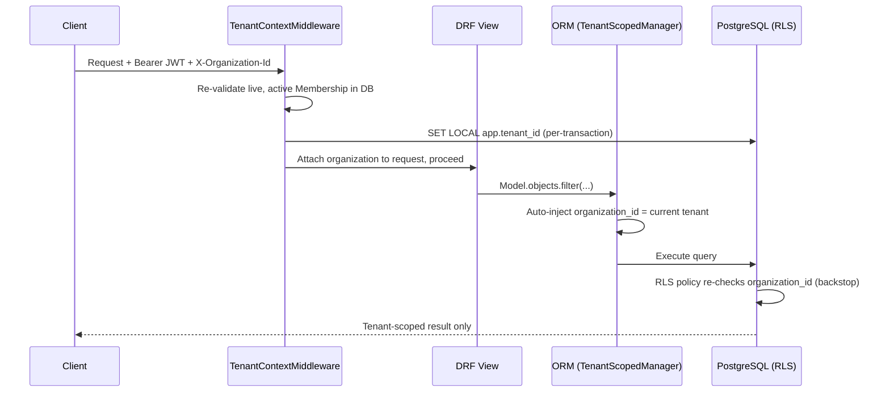

# Baseline — Backend


Django + Django REST Framework API for **Baseline** — a multi-tenant B2B
SaaS combining CRM, project management, invoicing, and internal
operations tooling. Part of the [`baseline_app`](../README.md) monorepo —
see the root README for the cross-cutting picture (frontend, Docker
orchestration, naming, deployment).

---

## Table of Contents

- [Architecture](#architecture)
- [Project Structure](#project-structure)
- [Requirements](#requirements)
- [Setup — via Docker](#setup--via-docker-recommended)
- [Setup — without Docker](#setup--without-docker)
- [Environment Variables](#environment-variables)
- [Settings Modules](#settings-modules)
- [API Reference](#api-reference)
- [Testing](#testing)
- [Security Model](#security-model)
- [Deployment](#deployment)
- [Troubleshooting](#troubleshooting)
- [What's Deliberately Not Built](#whats-deliberately-not-built)

---

## Architecture

### Domain apps

One Django project, one deployment unit — a monolith by design, not a
microservices split. Eleven domain-separated apps as peers under `apps/`:

| App | Responsibility |
|---|---|
| `accounts` | Custom `User` model (email-based), abstracted auth backend (SSO-ready) |
| `core` | `Organization`, `Membership`, RBAC (`Permission`/`RolePermission`), `Invitation`, append-only `AuditLog` — the tenant boundary itself |
| `customers` | Customer records, NDPA-aware fields (`data_source`, `consent_obtained_at`), real hard-delete for erasure requests |
| `leads` | Lead pipeline, conversion-to-Customer flow (`Lead.convert()`) |
| `projects` | `Project` + nested `Task` model |
| `invoices` | Invoice lifecycle (draft → sent → paid/overdue/void); deletion disabled by design (financial record) |
| `billing` | `EntitlementService` (seat/project limits, active-subscription checks), Paystack/Opay webhook normalization |
| `documents` | File attachments with per-owner FKs (customer/project/invoice), DB-enforced exactly-one-owner constraint |
| `notifications` | Centralized `NotificationService`, personal (non-RBAC-gated) per-user notifications |
| `analytics` | Read-only aggregation layer over the core-loop models — no persisted models of its own |
| `platform_admin` | Internal staff tooling, gated by `is_staff`, structurally isolated from tenant RBAC |

### Tenant isolation — two layers, neither sufficient alone



1. **ORM layer** (`apps/core/managers.py`) — `TenantScopedModel` /
   `TenantScopedManager` auto-filter every query by
   `organization_id = <current tenant>`, sourced from a request-scoped
   `contextvar` (`apps/core/context.py`), never from client input.
2. **Database layer, backstop** (`apps/core/migrations/0002_row_level_security.py`
   and the equivalent per-app migrations) — Postgres Row-Level Security.
   Catches anything that bypasses the ORM layer: raw SQL, the Django
   admin, a buggy one-off script, human error in a shell session.

Both layers are set together, once per request, by
`TenantContextMiddleware` (`apps/core/middleware.py`), which also
re-validates the requested Organization against a **live** Membership row
on every single request — a revoked Membership fails immediately even
with a still-unexpired JWT.

> **Rule:** never add a new tenant-scoped model without inheriting
> `TenantScopedModel`. A model that skips it has zero tenant isolation at
> the ORM layer and is very likely also missing the matching RLS policy.

### RBAC

Centralized in `apps/core/permissions.py` — `has_permission()` /
`RequirePermission` are the *only* sanctioned way to gate an action.
Role → permission grants are seeded via migration
(`apps/core/migrations/0003_seed_rbac.py`,
`0004_seed_extended_permissions.py`), cached process-wide, and invalidated
via a `post_migrate` signal.

### Audit logging

`apps/core/audit.py`'s `record()` is the only sanctioned write path for
`AuditLog`. The model is append-only, enforced at **two** levels: the ORM
(`AuditLogQuerySet` raises `NotImplementedError` on `.update()`/`.delete()`)
and the database (a Postgres trigger raises on `UPDATE`/`DELETE`,
independent of which role executes the statement).

### Billing & entitlements

`EntitlementService` (`apps/billing/services.py`) is the single path for
"can this org do X" checks — seat limits, project limits, active
subscription — and is actually wired into the paths that matter:
`ProjectViewSet.perform_create`, `InvitationViewSet.perform_create`
(fail-fast), and `InvitationAcceptView` (the authoritative check, since a
seat is only truly consumed at acceptance). Every new `Organization`
auto-provisions a `trial` Entitlement via a `post_save` signal
(`apps/billing/signals.py`), preventing enforcement from locking a
brand-new org out of its own first action. Paystack and Opay webhooks
both normalize into the same `Entitlement` write path
(`apps/billing/webhooks.py`), idempotent via
`WebhookEvent.provider_event_id`.

### Background jobs

Celery + Celery Beat (`config/celery.py`,
`CELERY_BEAT_SCHEDULE` in `config/settings/base.py`):

| Task | Schedule | Effect |
|---|---|---|
| `apps.invoices.tasks.check_overdue_invoices` | Hourly | Flips past-due `SENT` invoices to `OVERDUE`, notifies org Owners/Admins |
| `apps.projects.tasks.notify_tasks_due_soon` | Daily, 08:00 UTC | Notifies a Task's assignee when it's due tomorrow — idempotent per day |

### Documents

Per-owner explicit FKs (`customer`/`project`/`invoice`) rather than a
polymorphic `GenericForeignKey` — preserves real DB referential integrity
and lets RLS apply uniformly. A DB `CheckConstraint` enforces exactly one
owner. Local filesystem storage today; swapping to S3-compatible storage
is a `STORAGES` settings change, not a model change.

### Notifications

Created exclusively through `NotificationService`, mirroring the
audit-log centralization pattern. Uses a loose (non-FK)
`resource_type`/`resource_id` reference rather than a FK — a stale
reference here is a harmless UX nit, not a security/integrity problem,
unlike Documents. Gated by `recipient=request.user`, not RBAC —
notifications are inherently personal.

### Analytics

No persisted models — a pure read/aggregation layer
(`AnalyticsService`) over the core-loop models, inheriting tenant
isolation for free from each model's own `TenantScopedManager`. Gated by
`analytics:view` RBAC (revenue/pipeline data is sensitive, unlike
Notifications).

### NDPA (Nigeria Data Protection Act) compliance

Customer/Lead carry `data_source` + `consent_obtained_at` for
non-directly-collected data. `Customer.hard_delete()` performs a real DB
delete for data-subject erasure requests — distinct from the ordinary
`is_archived` workflow flag, which never removes data.

---

## Project Structure

```
backend/
├── apps/
│   ├── accounts/         # User model, auth backend
│   ├── core/              # Organization, Membership, RBAC, Invitation, AuditLog
│   ├── customers/
│   ├── leads/
│   ├── projects/           # Project + Task
│   ├── invoices/
│   ├── billing/             # EntitlementService, Plan, Entitlement, webhooks
│   ├── documents/
│   ├── notifications/
│   ├── analytics/
│   └── platform_admin/
├── config/
│   ├── settings/
│   │   ├── base.py          # shared settings
│   │   ├── development.py
│   │   ├── production.py
│   │   └── test.py
│   ├── celery.py
│   └── urls.py
├── requests.http           # every endpoint, ready to run
├── conftest.py             # pytest fixtures (org/user/membership factories, tenant context)
├── pytest.ini
├── manage.py
├── Dockerfile
├── requirements.txt
├── requirements-dev.txt
├── .env / .env.example
└── media/                  # local file storage for Document uploads (gitignored)
```

Each app follows the same internal shape: `models.py`, `serializers.py`,
`views.py`, `urls.py`, `admin.py`, `migrations/`, `tests/`. Apps needing a
service layer add `services.py` (`billing`) or a dedicated module
(`core/audit.py`, `core/permissions.py`).

---

## Requirements

- **Python 3.12+**
- **PostgreSQL 16+** — hard requirement, not a preference. RLS policies
  are Postgres-specific and are the second of two tenant-isolation
  enforcement layers (see [Architecture](#architecture)) — they cannot be
  exercised against SQLite/MySQL. **Do not substitute SQLite for local
  dev**; `docker compose up` (below) gets you a real Postgres instance in
  one command.
- **Redis 7+** — Celery broker + result backend.

---

## Setup — via Docker (recommended)

This backend is part of the `baseline_app` monorepo — `docker-compose.yml`
lives at the **monorepo root** (one level up from this directory), so it
can orchestrate the frontend alongside it. Run these from the repo root,
not from `backend/`:

```bash
cp backend/.env.example backend/.env
# edit backend/.env: DJANGO_SECRET_KEY at minimum
# (DB_HOST / CELERY_* are overridden by docker-compose.yml to point at
# the `db` / `redis` service names — leave them as-is for Docker use)

docker compose up --build
docker compose exec web python manage.py migrate
docker compose exec web python manage.py createsuperuser
```

This starts Postgres, Redis, the Django app (`web`), a Celery worker,
Celery Beat, and the frontend dev server together. `celery_beat` requires
`django_celery_beat` migrations to have run (included in the standard
`migrate` above) — it reads its schedule from the database
(`DatabaseScheduler`), not a static file, so schedule changes made via
the Django admin's **Periodic Tasks** section take effect without a
restart.

---

## Setup — without Docker

Run these from inside `backend/`:

```bash
python -m venv .venv && source .venv/bin/activate
pip install -r requirements-dev.txt

cp .env.example .env
# edit .env: DJANGO_SECRET_KEY, DB_*, CELERY_* at minimum

createdb baseline          # requires a local Postgres install
# requires a local Redis install too, for Celery
python manage.py migrate
python manage.py createsuperuser
python manage.py runserver

# in separate terminals:
celery -A config worker -l info
celery -A config beat -l info --scheduler django_celery_beat.schedulers:DatabaseScheduler
```

---

## Environment Variables

Full reference — see `.env.example` for the always-current committed
template.

| Variable | Required | Default | Description |
|---|---|---|---|
| `DJANGO_SETTINGS_MODULE` | No | `config.settings.development` | Which settings module to load |
| `DJANGO_SECRET_KEY` | **Yes** | — | Django cryptographic signing key. Generate with `python -c "import secrets; print(secrets.token_urlsafe(50))"` |
| `ALLOWED_HOSTS` | No | `localhost,127.0.0.1` | Comma-separated allowed `Host` headers |
| `CORS_ALLOWED_ORIGINS` | No | `http://localhost:3000` | Comma-separated allowed CORS origins (the frontend's URL) |
| `DB_NAME` | **Yes** | — | PostgreSQL database name |
| `DB_USER` | **Yes** | — | PostgreSQL user |
| `DB_PASSWORD` | **Yes** | — | PostgreSQL password |
| `DB_HOST` | No | `localhost` | PostgreSQL host (`db` under Docker Compose) |
| `DB_PORT` | No | `5432` | PostgreSQL port |
| `DB_CONN_MAX_AGE` | No | `60` | Persistent connection lifetime, seconds |
| `CELERY_BROKER_URL` | No | `redis://localhost:6379/0` | Celery broker (`redis://redis:6379/0` under Docker Compose) |
| `CELERY_RESULT_BACKEND` | No | `redis://localhost:6379/0` | Celery result backend |
| `EMAIL_BACKEND` | No | `django.core.mail.backends.console.EmailBackend` | Django email backend — console until a transactional provider is confirmed |
| `DEFAULT_FROM_EMAIL` | No | `no-reply@baseline.app` | Default "from" address |
| `PAYSTACK_SECRET_KEY` | No¹ | *(empty)* | Paystack API secret key |
| `PAYSTACK_WEBHOOK_SECRET` | No¹ | *(empty)* | Paystack webhook HMAC secret — verification fails closed (401) if unset |
| `OPAY_SECRET_KEY` | No¹ | *(empty)* | Opay API secret key |
| `OPAY_WEBHOOK_SECRET` | No¹ | *(empty)* | Opay webhook HMAC secret — verification fails closed (401) if unset |
| `SENTRY_DSN` | No | *(empty)* | Sentry error tracking DSN — SDK no-ops if unset. Only active when `DEBUG=False` |
| `SENTRY_TRACES_SAMPLE_RATE` | No | `0.1` | Sentry performance-tracing sample rate |
| `ENVIRONMENT` | No | `development` | Reported to Sentry as the environment tag |
| `DJANGO_LOG_LEVEL` | No | `INFO` | Root logger level |
| `SQL_LOG_LEVEL` | No | `WARNING` | `django.db.backends` logger level (dev only) |
| `TEST_DB_NAME` | No | `baseline_test` | Database name used by `config.settings.test` |

¹ *Required only to accept real Paystack/Opay webhooks — safe to leave
blank in local dev, where billing simply can't be exercised end-to-end.*

**Production-only** (set in `config/settings/production.py`, sourced from
env at deploy time — not present in `.env.example` since they have no
sensible local-dev default):

| Variable | Required | Description |
|---|---|---|
| `ALLOWED_HOSTS` | **Yes** | No default in production — must be set explicitly |
| `CORS_ALLOWED_ORIGINS` | **Yes** | No default in production — must be set explicitly |

---

## Settings Modules

Four environments under `config/settings/`:

| Module | Purpose |
|---|---|
| `base.py` | Shared settings — installed apps, middleware, DRF/JWT/Celery config, logging |
| `development.py` | `DEBUG=True`, permissive CORS, SQL query logging available |
| `production.py` | `DEBUG=False`, HSTS/SSL redirect/secure cookies enforced, Sentry wired if `SENTRY_DSN` set, explicit `ALLOWED_HOSTS`/`CORS_ALLOWED_ORIGINS` required (no default) |
| `test.py` | Extends `development.py`; fast password hasher, in-memory email backend, `CELERY_TASK_ALWAYS_EAGER=True` |

Selected via `DJANGO_SETTINGS_MODULE`. `manage.py` defaults to
`development`; `wsgi.py`/`asgi.py` default to `production`.

---

## API Reference

All endpoints are under `/api/v1/`. **The complete, runnable reference is
[`requests.http`](requests.http)** — every route below, with realistic
payloads, ordered as an end-to-end flow. This table is the quick-scan
index.

Every tenant-scoped request requires:
- `Authorization: Bearer <access_token>`
- `X-Organization-Id: <uuid>` — re-validated against a live `Membership`
  on every request, never trusted from the token alone

Exempt from `X-Organization-Id`: auth routes, invitation-accept, health
check, admin, billing webhooks — see
`TenantContextMiddleware.TENANT_EXEMPT_PATH_PREFIXES`.

| Method | Path | Auth required | Notes |
|---|---|---|---|
| `GET` | `/health/` | No | Health check |
| `POST` | `/api/v1/auth/register/` | No | |
| `POST` | `/api/v1/auth/login/` | No | Returns JWT pair |
| `POST` | `/api/v1/auth/logout/` | Bearer | Blacklists refresh token |
| `POST` | `/api/v1/auth/token/refresh/` | No | |
| `GET` | `/api/v1/auth/me/` | Bearer | |
| `GET` | `/api/v1/memberships/` | Bearer + Org | |
| `GET` | `/api/v1/memberships/{id}/` | Bearer + Org | |
| `GET`, `POST` | `/api/v1/invitations/` | Bearer + Org | `invitations:create` to POST |
| `DELETE` | `/api/v1/invitations/{id}/` | Bearer + Org | `invitations:revoke` |
| `POST` | `/api/v1/invitations/accept/` | Bearer only | No Org header — membership doesn't exist yet |
| `GET`, `POST` | `/api/v1/customers/` | Bearer + Org | `customers:create` to POST |
| `GET`, `PATCH`, `DELETE` | `/api/v1/customers/{id}/` | Bearer + Org | `customers:update` / `customers:delete` |
| `GET`, `POST` | `/api/v1/leads/` | Bearer + Org | `leads:create` to POST |
| `GET`, `PATCH`, `DELETE` | `/api/v1/leads/{id}/` | Bearer + Org | `leads:update` / `leads:delete` |
| `POST` | `/api/v1/leads/{id}/convert/` | Bearer + Org | `leads:convert` |
| `GET`, `POST` | `/api/v1/projects/` | Bearer + Org | `projects:create` (entitlement-checked) |
| `GET`, `PATCH`, `DELETE` | `/api/v1/projects/{id}/` | Bearer + Org | `projects:update` / `projects:delete` |
| `GET`, `POST` | `/api/v1/tasks/` | Bearer + Org | `tasks:create` |
| `GET`, `PATCH`, `DELETE` | `/api/v1/tasks/{id}/` | Bearer + Org | `tasks:update` / `tasks:delete` |
| `GET`, `POST` | `/api/v1/invoices/` | Bearer + Org | `invoices:create` — `customer` required |
| `GET`, `PATCH` | `/api/v1/invoices/{id}/` | Bearer + Org | `DELETE` returns `405` by design |
| `POST` | `/api/v1/invoices/{id}/mark_paid/` | Bearer + Org | |
| `POST` | `/api/v1/invoices/{id}/void/` | Bearer + Org | `invoices:void` |
| `GET`, `POST` | `/api/v1/documents/` | Bearer + Org | `documents:create` — multipart upload |
| `GET`, `DELETE` | `/api/v1/documents/{id}/` | Bearer + Org | `documents:delete` |
| `GET` | `/api/v1/notifications/` | Bearer + Org | Scoped to `recipient=request.user` |
| `GET` | `/api/v1/notifications/unread_count/` | Bearer + Org | |
| `POST` | `/api/v1/notifications/{id}/mark_read/` | Bearer + Org | |
| `POST` | `/api/v1/notifications/mark_all_read/` | Bearer + Org | |
| `GET` | `/api/v1/analytics/dashboard/` | Bearer + Org | `analytics:view` |
| `POST` | `/api/v1/billing/webhooks/paystack/` | HMAC signature | Not Bearer/Org — provider-to-server |
| `POST` | `/api/v1/billing/webhooks/opay/` | HMAC signature | Not Bearer/Org — provider-to-server |
| `GET` | `/api/v1/platform-admin/organizations/` | Bearer, `is_staff` | Cross-tenant search |
| `GET` | `/api/v1/platform-admin/organizations/{id}/` | Bearer, `is_staff` | |
| `POST` | `/api/v1/platform-admin/organizations/{id}/suspend/` | Bearer, `is_staff` | |
| `POST` | `/api/v1/platform-admin/organizations/{id}/unsuspend/` | Bearer, `is_staff` | |

---

## Testing

```bash
createdb baseline_test
pytest
```

Requires a real PostgreSQL connection — same reason as everywhere else in
this document: RLS can't be exercised against SQLite.
`pytest-django` reuses the test DB across runs via `--reuse-db` (see
`pytest.ini`); pass `--create-db` to force a rebuild after a migration
change.

**Coverage areas:** tenant isolation (`TenantScopedManager`, `unscoped()`,
context-manager correctness), RBAC grant/deny logic, `AuditLog`
immutability (ORM + DB layer), NDPA hard-delete, Lead→Customer conversion
(including the upsell-link case), optional-FK relationships
(Project↔Customer, Task↔Project), required-FK enforcement
(Invoice↔Customer), Document ownership constraint, entitlement
enforcement (seat/project limits actually blocking creation, not just
existing as an unused service), and scheduled-task idempotency (a second
same-day run doesn't double-notify).

> **Note on verification:** the full suite was written and the model
> graph validated via `manage.py check` / `makemigrations --dry-run`
> (both pass clean), but has not been executed against a live database
> from this side of the work — no Postgres binary was available in the
> environment this was built in. Run `pytest` for real before treating it
> as verified rather than internally consistent.

---

## Security Model

See the root README's [Security](../README.md#security) section for the
cross-cutting summary. Backend-specific detail:

- **JWT:** 15-minute access token lifetime, 7-day rotating refresh token
  with blacklist-on-rotation (`rest_framework_simplejwt.token_blacklist`).
- **Password policy:** Django's built-in validators, minimum length 12.
- **Webhook authentication:** HMAC-SHA512 (Paystack) / HMAC-SHA256 (Opay)
  signature verification against the raw request body, before any JSON
  parsing — verification failure short-circuits to `401` immediately.
- **Production hardening** (`config/settings/production.py`): forced SSL
  redirect, HSTS (1 year, includes subdomains, preload), secure/HttpOnly
  cookies, `X-Frame-Options: DENY`, explicit `ALLOWED_HOSTS`/
  `CORS_ALLOWED_ORIGINS` (no default — fails loudly if unset rather than
  falling back to something permissive).

---

## Deployment

See the root README's [Deployment](../README.md#deployment) table.
Backend-specific: `Dockerfile` is a multi-stage build (separate `build`
stage with compilers, slim `runtime` stage), runs as a non-root user, and
serves via `gunicorn` — not `manage.py runserver` — in the final image.

---

## Troubleshooting

See the root README's [Troubleshooting](../README.md#troubleshooting)
table for cross-cutting issues. Backend-specific:

| Symptom | Likely cause | Fix |
|---|---|---|
| `AuditLog` write raises `NotImplementedError` | Something tried to `.update()`/`.delete()` an AuditLog row directly | This is intentional — append-only by design. Create a new entry via `apps.core.audit.record()` instead |
| Webhook returns `401` | `PAYSTACK_WEBHOOK_SECRET`/`OPAY_WEBHOOK_SECRET` unset or incorrect | Set the real secret from your provider dashboard; verification fails closed by design when unset |
| Celery Beat schedule doesn't seem to update | Confusing the static `CELERY_BEAT_SCHEDULE` in settings with the DB-backed `DatabaseScheduler` | Beat reads from the database (`django_celery_beat` tables) at runtime — edit via Django admin's "Periodic Tasks," not just the settings file |

---

## What's Deliberately Not Built

Every backend module in the confirmed app list is built:
`accounts`, `core`, `customers`, `leads`, `projects`, `invoices`,
`billing`, `documents`, `notifications`, `analytics`, `platform_admin`.

Explicitly out of scope for this delivery: infrastructure-as-code, CI
pipeline, load/penetration testing, and a public Organization-creation
(signup) endpoint. See the root README's [Roadmap](../README.md#roadmap).